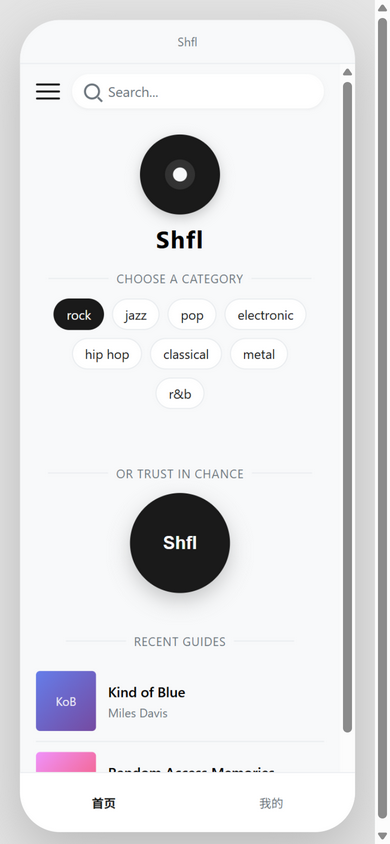
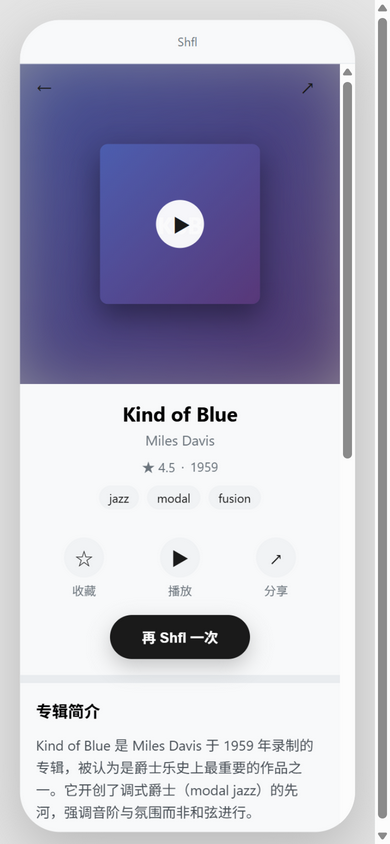
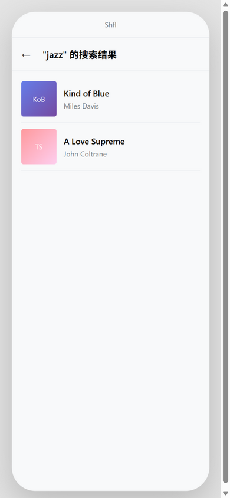
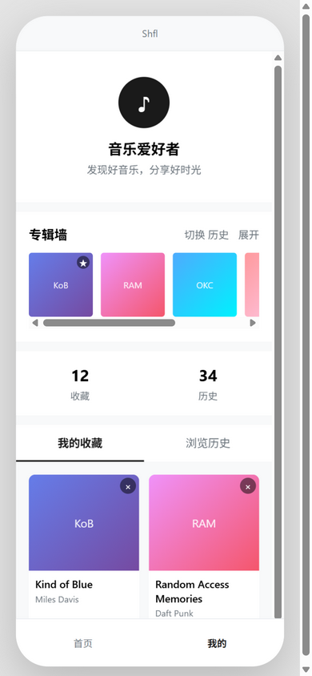
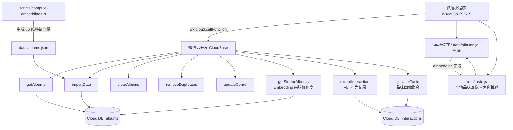
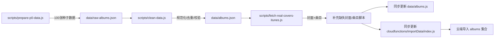

# Shfl | AI 音乐专辑发现小程序

> 基于 **Embedding + RAG + 用户 Memory** 的 AI 音乐专辑发现小程序，帮「想拓展听歌范围的音乐爱好者」用自然语言和品味记录找到下一张喜欢的专辑。

---

## 一句话定位

**Shfl = 你的 AI 音乐探索伙伴。**

不是传统的歌单推荐，而是围绕「专辑」这一音乐文化最小完整单元，通过结构化数据、向量相似度、RAG 音乐探索 Agent 和用户品味记忆，回答一个问题：

> 如果我喜欢 X，下一张该听什么？为什么？

---

## 目标用户与核心问题

| 维度 | 说明 |
|---|---|
| **目标用户** | 音乐爱好者、实体唱片/黑胶消费者、想破圈听歌的人 |
| **核心问题** | 歌单同质化严重，想发现新专辑但不知道从哪里开始 |
| **使用场景** | 随机探索、按风格/情绪筛选、用自然语言描述心情找专辑、查看「为什么推荐」的解释 |

---

## 功能特性

- **首页推荐**：每日专辑流 + 随机推荐，支持下拉刷新
- **为你推荐**：基于用户 Memory（收藏/浏览历史）与 Embedding 品味向量的个性化推荐，附「为什么推荐」解释
- **风格/情绪探索**：多维度标签筛选，帮助用户拓展听歌边界
- **专辑详情**：封面、曲目、简介、评分、来源平台一键跳转
- **相似推荐**：基于 Embedding 余弦相似度检索相似专辑，展示共享流派/年代的推荐理由
- **AI 探索（P2 进行中）**：自然语言提问，RAG 返回带解释的专辑推荐
- **用户 Memory**：`recordInteraction` 云函数记录浏览/收藏行为，`getUserTaste` 聚合生成品味画像（风格/年代偏好）
- **离线兜底**：网络异常时自动切换本地缓存或内置数据，避免白屏
- **全局异常页**：未捕获错误自动跳转兜底页

---

## Demo

| 首页 · 风格探索 | 专辑详情 |
|---|---|
|  |  |

| 搜索结果 | 我的 · 收藏与历史 |
|---|---|
|  |  |

> 截图来自 [prototype/index.html](./prototype/index.html) 可点击原型，实际小程序界面与之保持一致。
>
> GIF / 视频 Demo 建议录制场景：
> 1. 首页下拉刷新，展示 100 张专辑流
> 2. 点击风格标签筛选（如 jazz / hip hop / post-rock）
> 3. 随机推荐进入专辑详情，查看曲目和平台跳转
> 4. 关闭网络后展示本地兜底提示

---

## 技术架构



---

## 数据架构

### 专辑 Schema（Album Schema v1）

核心字段：

| 字段 | 类型 | 说明 |
|---|---|---|
| `_id` | string | 唯一标识 |
| `title` | string | 专辑名 |
| `artist` | string | 艺术家 |
| `year` | number | 发行年份 |
| `genre` | string[] | 风格标签数组，第一项为主风格 |
| `rating` | number | 综合评分 0-100 |
| `source` | string | 数据来源（RYM / Pitchfork / Metacritic / iTunes） |
| `coverUrl` | string | 封面 URL |
| `description` | string | 专辑简介，用于 RAG 上下文 |
| `tracks` | string[] | 曲目列表 |
| `mood` | string[] | 情绪标签 |
| `energy` | number | 能量值 0-100 |
| `bpm` | number | 平均 BPM |
| `tags` | string[] | 额外标签 |
| `culturalContext` | string | 文化背景/时代意义 |
| `embedding` | number[] | 文本/流派 Embedding（P2） |
| `metadata` | object | 数据管线元信息 |

完整 Schema 见：[data/schema.json](./data/schema.json)

### 数据管线



当前数据集：**100 张真实专辑**，`genre` 已数组化，封面来自 iTunes / Wikipedia，曲目来自 iTunes 或人工补充。

### Embedding（genre-feature-v1）

专辑相似检索与个性化推荐的基础向量模型，纯本地特征工程、无外部 API 依赖：

- **特征空间（76 维）**：流派（主流派权重 1.0 / 次流派 0.7）+ mood/tags（0.5）+ 年代桶（0.6）
- **归一化**：L2 归一化后余弦相似度 = 点积，可在小程序端/云函数端直接计算
- **词表**：[data/embedding-vocab.json](./data/embedding-vocab.json) 固化维度顺序，保证重算一致
- **生成脚本**：`node scripts/compute-embeddings.js`（就地更新 albums.json / albums.js / importData）
- **质量样例**：Kind of Blue → A Love Supreme (0.805)、OK Computer → In Rainbows (0.805)、Illmatic → Ready to Die (1.000)

数据量增长到万级后，可将「内存全量余弦」升级为预计算 top-K 或外部向量检索服务（见升级路线 P2+）。

### 用户 Memory（interactions 集合）

- **写入**：`recordInteraction` 云函数记录 `view / favorite / unfavorite / skip`，openid 由云端获取，view 10 分钟内去重
- **读取**：`getUserTaste` 聚合生成品味画像——topGenres / topDecades / topArtists，权重 favorite(3) > view(1) > skip(-1)，30 天半衰期
- **端侧画像**：[utils/taste.js](./utils/taste.js) 用本地收藏/历史 + Embedding 计算品味向量，离线也可生成「为你推荐」

---

## 项目结构

```
.
├── app.js / app.json / app.wxss          # 小程序入口与全局配置
├── pages/                                # 页面
│   ├── home/                             # 首页推荐
│   ├── search/                           # 搜索页
│   ├── search-result/                    # 搜索结果
│   ├── detail/                           # 专辑详情
│   ├── my/                               # 个人中心
│   └── error/                            # 全局错误兜底页
├── components/                           # 自定义组件（empty-state / sidebar 等）
├── custom-tab-bar/                       # 自定义底部导航
├── cloudfunctions/                       # 云函数
│   ├── getAlbums                         # 获取专辑列表
│   ├── importData                        # 导入数据
│   ├── clearAlbums                       # 清空数据
│   ├── removeDuplicates                  # 去重
│   ├── updateGenre                       # 更新流派
│   ├── getSimilarAlbums                  # Embedding 相似检索（P2）
│   ├── recordInteraction                 # 用户行为记录（P2）
│   └── getUserTaste                      # 品味画像聚合（P2）
├── data/                                 # 专辑数据
│   ├── schema.json                       # Album Schema v1
│   ├── albums.json                       # 100张清洗后数据
│   ├── albums.js                         # 本地兜底数据
│   └── raw-albums.json                   # 原始种子数据
├── scripts/                              # 数据清洗/导入/封面补充脚本
├── spider/                               # 数据采集（Scrapy 爬虫）
├── prototype/                            # 可点击 HTML 原型
├── docs/                                 # 文档
│   └── QUICKSTART.md                     # 快速开始指南
├── 小程序原型设计.md                      # 产品原型设计文档
└── project.config.json                   # 微信开发者工具配置
```

---

## 本地运行

1. 用[微信开发者工具](https://developers.weixin.qq.com/miniprogram/dev/devtools/download.html)打开本项目根目录
2. 在 `project.config.json` 中填入你自己的 AppID（或选择「测试号」）
3. 如需使用云函数，开通云开发后：
   - 复制 `env.example.js` 为 `env.config.js`，填入你的云开发环境 ID（该文件已被 gitignore，不会提交）
   - 在各云函数目录执行：
   ```bash
   npm install
   ```
   然后在开发者工具中右键「上传并部署：云端安装依赖」
4. 导入初始数据：
   - 部署 `cloudfunctions/importData`
   - 在云开发控制台 → 云函数 → `importData` → 测试，先传 `{ "clear": true }`，再传 `{}`
5. 确认 `albums` 集合权限为「所有用户可读，仅创建者可写」

---

## 产品原型

- **设计文档**：[小程序原型设计.md](./小程序原型设计.md)
- **可点击 HTML 原型**：[prototype/index.html](./prototype/index.html)

---

## 升级路线

| 阶段 | 目标 | 关键交付 |
|---|---|---|
| **P0** | 数据基础 | 100 张真实专辑、Schema v1、可扩展数据管线、改造 importData |
| **P1** | 基础可展示性 | README、架构图、Demo 素材、仓库整理 |
| **P2** | AI 能力差异化 | ✅ Embedding 相似检索、✅ 用户 Memory（行为记录 + 品味画像）、✅ 推荐解释；⏳ RAG Agent |
| **P3** | 作品包装 | Case Study、Portfolio、项目讲解稿、简历 bullet |

---

## License

本项目仅供学习与交流使用。
